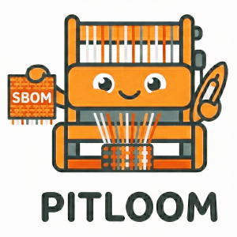

# Pitloom - SBOM generator for AI models and Python projects

[](https://pypi.org/project/pitloom/)

[](https://www.bestpractices.dev/projects/14001)
[](https://scorecard.dev/viewer/?uri=github.com/bact/pitloom)
[](https://doi.org/10.5281/zenodo.19246283)

*Automated transparency, woven from the ground up.*

**Pitloom** automates the generation of [SPDX 3]-compliant
software bills of materials (SBOMs) for Python applications and AI models.

It extracts metadata directly from Python projects, whether declared in
the standard `[project]` table (Flit, Hatchling, PDM, uv_build and others),
Poetry's `[tool.poetry]`, or setuptools' `setup.cfg` and `setup.py`,
and from leading AI model formats,
including PyTorch, ONNX, Safetensors, GGUF, and fastText.

With native Hatchling integration and an official GitHub Action,
Pitloom embeds SBOMs directly into your wheel distribution under
`.dist-info/sboms`, following the
PyPA [Package Installation Metadata][dist-info] specification ([PEP 770]) --
offering software supply chain transparency without disrupting
the build pipeline.

User manual: <https://bact.github.io/pitloom/>

[SPDX 3]: https://spdx.github.io/spdx-spec/
[dist-info]: https://packaging.python.org/en/latest/specifications/recording-installed-packages/#the-dist-info-directory
[PEP 770]: https://peps.python.org/pep-0770/



## Contents

- [Quick start](#quick-start)
- [Usage](#usage)
- [Example](#example)
- [Learn more](#learn-more)
- [Pitloom's own SBOM and signatures](#pitlooms-own-sbom-and-signatures)
- [License](#license)
- [Citation](#citation)
- [Name](#name)

## Quick start

```bash
pip install pitloom
loom project .     # SBOM for the Python project in the current dir
```

Extras enable more metadata extraction (see [CONTRIBUTING.md](CONTRIBUTING.md)
for the dev install):

```bash
pip install "pitloom[ai]"              # AI model files and Hugging Face Hub
pip install "pitloom[content-type]"    # content type detection (Magika)
```

## Usage

Pitloom produces the same SBOM for the same target on every surface. Pick the
one that fits how you work:

| Surface | Reach for this when... |
| :--- | :--- |
| [Command line](docs/cli.md) (`loom` / `pitloom`) | You want a one-off SBOM from a terminal, a Makefile target or a shell script. |
| [Hatchling build hook](docs/hatchling-build-hook.md) | You build wheels with Hatchling and want an SBOM embedded automatically. |
| [Python API](docs/python-api.md) | You call Pitloom from Python code, or want to capture provenance while training or evaluating a model (tracking decorator). |
| [GitHub Action](docs/github-action.md) | Your project is not Hatchling-based, or you want CI to produce an SBOM artifact. |
| [Agent Skills](docs/agent-skills.md) | You want an AI coding agent to generate, enrich or validate an SBOM on request. |
| [Claude Code plugin](docs/claude-code-plugin.md) | You use Claude Code and want the Skills installed with one command. |

### Command line

`loom -h` lists every option.

```bash
loom project .                                 # Source SBOM of a project
loom wheel dist/pkg-1.0-py3-none-any.whl       # Analyzed SBOM of a built wheel
loom env -o env.spdx3.json                     # Deployed SBOM of the installed environment
loom model path/to/model.safetensors           # Analyzed SBOM of one AI model file
loom model Qwen/Qwen3-235B-A22B                # ... or a Hugging Face Hub model (needs pitloom[huggingface_hub])
loom generate . -o sbom.spdx3.json             # detect the target type (-o is required)
```

`-o FILE` sets the output path. The per-file inventory (file list, hashes)
follows the project's build backend: accurate for Flit-core, Hatchling,
PDM-backend, Poetry and setuptools, and for uv_build with `--allow-build`;
other backends fall back to a heuristic with a `WARNING:`.
Lock files (`pylock.toml`, `uv.lock`, `poetry.lock`, `pdm.lock`,
`Pipfile.lock`, pinned `requirements.txt`) are read automatically;
opt out with `--no-use-lockfile`.
Local AI model formats: GGUF, ONNX, Safetensors,
PyTorch (`.pt`/`.pth`, `.pt2`), Keras, HDF5, NumPy, fastText, CRFsuite.

AI-model gaps (licence, datasets) can be filled from a README or model card's
YAML frontmatter, opt in with `--enrich`, or standalone as a mergeable
fragment:

```bash
loom enrich path/to/model.safetensors -o model.enrich.spdx3.json
```

See [Command line](docs/cli.md) for per-command detail,
[Wheel SBOMs](docs/wheel-sbom.md) for `embed-wheel`, `verify-wheel` and
`validate-wheel`, and [SBOM fragments](docs/fragments.md) for merging.

### Hatchling build hook

Embeds an SBOM at `.dist-info/sboms/<name>-<version>.spdx3.json` in every
wheel built ([PEP 770], compact canonical JSON). Needs Hatchling **1.29.0+**:

```toml
[build-system]
requires = ["hatchling>=1.29.0", "pitloom>=0.20.2"]
build-backend = "hatchling.build"

[tool.hatch.build.hooks.pitloom]
enabled = true    # set to false to skip SBOM generation
```

Basename, fragments, creators and provenance are set under `[tool.pitloom]`;
see the [hook page](docs/hatchling-build-hook.md) and
[Configuration](docs/configuration.md).

### Python API

```python
from pathlib import Path
from pitloom.core.creation import CreationMetadata, Creator
from pitloom.assemble import generate, generate_project_sbom

# Detects the target type
generate(
    target=Path("/path/to/project"),
    output_path=Path("sbom.spdx3.json"),
    creation_metadata=CreationMetadata(creators=[Creator(name="Your Name")]),
)

# Or a target-specific generator
generate_project_sbom(
    project_target=Path("/path/to/project"),
    output_path=Path("sbom.spdx3.json"),
)
```

`pitloom.assemble` also has `generate_wheel_sbom()`, `generate_model_sbom()`
and `generate_env_sbom()`.

**Tracking decorator.** Annotate a training or evaluation script, as a
decorator or a context manager, to write an SBOM fragment that Pitloom merges
at build time. Use `set_model` for a model you produce, `use_model` for one
you consume:

```python
from pitloom import loom


@loom.run(output_file="fragments/sentiment_model.json")
def train_model():
    loom.set_model("sentiment-clf")
    loom.add_dataset("imdb-reviews", dataset_type="text")
    # ... training logic ...


@loom.run(output_file="fragments/sentiment_eval.json")
def evaluate_model():
    loom.use_model("sentiment-clf")
    loom.add_dataset("imdb-test-set", dataset_type="text")
    # ... evaluation logic ...
```

See [Python API](docs/python-api.md) for lineage between several datasets in
one run, and [Loom ID registry](docs/id-registry.md) for stable ids across fragments.

### GitHub Action

SBOM generation in CI, for any Python build backend:

```yaml
- uses: actions/setup-python@v7
  with:
    python-version: "3.x"
- uses: bact/pitloom@v0.20.2
```

Add `embed-wheel: "dist/*.whl"` to embed the SBOM into built wheels. See
[GitHub Action](docs/github-action.md) for inputs, outputs and recipes.

### Agent Skills and Claude Code plugin

`skills/sbom-generate/`, `skills/sbom-enrich/` and `skills/sbom-validate/`
are [Agent Skills](https://agentskills.io) for Claude Code, the Claude Agent
SDK and other compatible clients. Ask in plain language ("generate an SBOM
for this project") or invoke one: `/sbom-generate [target]`,
`/sbom-enrich [sbom-file]`, `/sbom-validate [sbom-file]`. Generate first;
`sbom-enrich` needs an existing Pitloom SBOM.

For Claude Code, install all three as a plugin from this repository:

```text
/plugin marketplace add bact/pitloom
/plugin install pitloom@pitloom
```

The Skills are then namespaced, e.g. `/pitloom:sbom-generate`. See [Agent
Skills](docs/agent-skills.md) (install into other clients) and [Claude Code
plugin](docs/claude-code-plugin.md).

## Example

```bash
git clone https://github.com/bact/sentimentdemo.git
loom project sentimentdemo
```

The generated SBOM includes project metadata, dependencies with version
constraints, SPDX relationships, creator/creation info and per-field metadata
provenance. See a more complete example in [examples/](./examples/).

## Learn more

- [Configuration](docs/configuration.md): every `[tool.pitloom]` setting and
  how each surface reads it.
- [Creation metadata](docs/creation-metadata.md): who, what, when and how each
  element records its creation (`--creator-name`, `--creation-tool`, ...).
- [Metadata provenance](docs/metadata-provenance.md): SPDX 3 `Annotation`
  elements recording the source of each field, so "why does the SBOM say the
  concluded licence is MIT?" has a traceable answer.
- [Loom ID registry](docs/id-registry.md): an optional registry that keeps `spdxId`s
  stable across fragments and runs.
- [Resources](docs/resources.md): SBOM, AIBOM and SPDX reading list.
- [SPDX 3.0 Specification](https://spdx.dev/wp-content/uploads/sites/31/2024/12/SPDX-3.0.1-1.pdf),
  [PEP 770](https://peps.python.org/pep-0770/) and Bennet et al.,
  [“Implementing AI Bill of Materials with SPDX 3.0”](https://www.linuxfoundation.org/research/ai-bom),
  The Linux Foundation, 2024.

## Pitloom's own SBOM and signatures

Pitloom's [Hatchling build hook](#hatchling-build-hook) writes Pitloom's SBOM
into its wheel, at `.dist-info/sboms/<name>-<version>.spdx3.json` ([PEP 770]).
The release build installs the `content-type` extra, so every non-empty
file's content type is detected by magika.

Each [GitHub release](https://github.com/bact/pitloom/releases) attaches:

- the wheel and the sdist;
- the same SBOM as a standalone file, byte-identical to the one in the wheel;
- Sigstore bundles (`*.sigstore.json`) for the wheel, the sdist and the SBOM.

The same three files also have a GitHub artifact attestation (build
provenance), kept by GitHub, not attached to the release.

To check a download (`<file>` is the wheel, the sdist or the SBOM; the
Sigstore bundle path defaults to `<file>.sigstore.json`, `--bundle` overrides
it):

```shell
loom verify-wheel <file>.whl
pip install sigstore
# download <file> and <file>.sigstore.json from the release into one directory
python -m sigstore verify github <file> \
  --cert-identity https://github.com/bact/pitloom/.github/workflows/pypi-publish.yml@refs/tags/v<version>
gh attestation verify <file> -R bact/pitloom \
  --signer-workflow bact/pitloom/.github/workflows/pypi-publish.yml \
  --source-ref refs/tags/v<version>
```

## License

- Source code: Apache License 2.0.
- Documentation: Creative Commons Attribution 4.0 International.
- Test fixture AI models: individually licensed (Apache-2.0, CC0-1.0, or
  MIT); see [tests/fixtures/README.md](tests/fixtures/README.md). Source
  repository only -- not included in distribution packages.

## Citation

If you use this software, please cite it as follows:

> Suriyawongkul, A. (2026). Pitloom - SBOM generator for AI models and Python projects (Version 0.20.2) [Computer software]. <https://doi.org/10.5281/zenodo.19246283>

BibTeX:

```bibtex
@software{Suriyawongkul_Pitloom_SBOM_2026,
    author = {Suriyawongkul, Arthit},
    doi = {10.5281/zenodo.19246283},
    month = oct,
    title = {{Pitloom - SBOM generator for AI models and Python projects}},
    url = {https://github.com/bact/pitloom},
    version = {0.20.2},
    year = {2026}
}
```

## Name

A [pit loom](https://en.wikipedia.org/wiki/Loom#Treadle_loom)
is a traditional handloom built into a ground-level pit
to house its internal mechanisms and the weaver's legs.
This "grounded" design provides stability and precision
during the weaving process.

We use the loom as a metaphor for the tool's function:
it weaves disparate threads of metadata into a cohesive SBOM,
creating a transparent, structured "fabric" for the software build.
