# End-to-end flow: extraction to SBOM

A one-page map of how a call becomes an SBOM. Deliberately generic --
it names stable stages and top-level types, not individual extractor
modules or lock formats, so a new lock format or a new AI-model
extractor doesn't require updating this diagram. For per-topic detail,
follow the "See also" links below instead of expanding this page.

See also: [architecture-overview.md](../design/architecture-overview.md)
for the fuller (and more speculative/planned-integration-heavy)
picture this page distills; [sbom-lifecycle-stages.md](sbom-lifecycle-stages.md)
for the source-stage vs. build-stage distinction that decides which
entry point runs; [lock-file-cascade.md](lock-file-cascade.md) and
[metadata-provenance.md](../../docs/metadata-provenance.md) for two of
the stages below in depth.

## The diagram

```mermaid
flowchart LR
    subgraph Sources["Sources"]
        direction TB
        S1["Project config<br/>&#40;pyproject.toml, setup.cfg/.py&#41;"]
        S2["Lock / pin files<br/>&#40;one per supported format&#41;"]
        S3["Built wheel<br/>&#40;or installed env&#41;"]
        S4["AI model / dataset files,<br/>tracking platforms, SBOM fragments"]
        S5["Externally-generated SBOM<br/>&#40;embed-wheel --sbom&#41;"]
    end

    subgraph Extract["Extraction  --  pitloom.extract.*"]
        direction TB
        E1["Metadata extractors<br/>&#40;one per source format&#41;"]
        E2["Lock/pin priority cascade<br/>&#40;highest-priority usable source wins&#41;"]
    end

    subgraph Model["Format-neutral model  --  pitloom.core.*"]
        direction TB
        M1["ProjectMetadata<br/>&#40;+ locked_dependencies, + provenance&#41;"]
        M2["AiModelMetadata / DatasetMetadata /<br/>FragmentConfig"]
        M3["DocumentModel"]
    end

    subgraph Assemble["Assembly  --  pitloom.assemble.spdx3.*"]
        A1["build&#40;doc&#41;<br/>packages, relationships, licenses,<br/>provenance annotations"]
    end

    subgraph Output["Output"]
        direction TB
        O1["Spdx3JsonExporter"]
        O2["SPDX 3 JSON-LD SBOM"]
        O3["Embed into wheel archive<br/>&#40;PEP 770, .dist-info/sboms/&#41;"]
    end

    S1 --> E1
    S2 --> E2
    S3 --> E1
    S4 --> E1

    E1 --> M1
    E2 -. "overlays onto" .-> M1
    E1 --> M2

    M1 --> M3
    M2 --> M3

    M3 --> A1
    A1 --> O1
    O1 --> O2

    O2 -. "embed-wheel" .-> O3
    S5 -. "embed-wheel --sbom<br/>&#40;skips extraction/assembly&#41;" .-> O3
    S3 -. "same wheel file, rewritten" .-> O3
```

## Reading it

- **Sources -> Extraction** is many-to-many by design: every supported
  project-config format, lock format, and AI-model/dataset format gets
  its own extractor module, but they all converge on the same two model
  types one level up. Adding a seventh lock format or a new AI-model
  format changes this layer's *inside*, never this diagram.
- **The lock/pin cascade is a distinct step from ordinary extraction**:
  it doesn't produce its own `ProjectMetadata` -- it overlays
  `locked_dependencies` and a `provenance["locked_dependencies"]`
  annotation onto whichever metadata the config-format extractor
  already produced. See
  [lock-file-cascade.md](lock-file-cascade.md).
- **`ProjectMetadata`/`DocumentModel` are the seam.** Every extractor's
  job is to populate one of these two dataclasses; every assembler's
  job is to read them. Neither side needs to know how the other is
  implemented -- that's what makes this diagram stable across either
  side changing internally.
- **Two real entry points converge on the same seam**: the CLI
  (`pitloom.__main__`) and the public library API
  (`generate_project_sbom()`, etc.) both resolve metadata via
  `pitloom.extract.project.read_project()` and both call
  `pitloom.assemble.spdx3.document.build()`; the Hatchling build hook
  (`pitloom.plugins.hatch`) resolves metadata via
  `pitloom.extract.hatchling.metadata_from_hatchling()` instead (a
  build-stage source, never a lock file -- see
  [sbom-lifecycle-stages.md](sbom-lifecycle-stages.md)) but converges
  on the same `build()` call. All three end up in the same box in this
  diagram.
- **Provenance rides alongside data at every stage**, not as an
  afterthought bolted on at the end: each extractor records where a
  field came from in `ProjectMetadata.provenance`, `build()` reads it
  to annotate relationships (e.g. `RelationshipCompleteness`,
  `declared_constraint`), and the final SBOM carries those annotations
  for a human or downstream tool to inspect. See
  [metadata-provenance.md](../../docs/metadata-provenance.md).
- **`embed-wheel` is the same pipeline with one extra terminal, not a
  separate pipeline.** `loom embed-wheel <wheel>` builds an SBOM the
  usual way (from the wheel alone, or from the wheel plus a
  `--project-dir` source tree -- either way with
  `include_locked_dependencies=False`, since embedding is build-stage
  and a source-stage lock file's resolved dependencies must never leak
  into it, per [sbom-lifecycle-stages.md](sbom-lifecycle-stages.md)),
  then writes the result into that *same* wheel's
  `.dist-info/sboms/` directory instead of (or alongside) emitting a
  standalone file. `embed-wheel --sbom <path>` skips extraction and
  assembly entirely and embeds an already-built SBOM as-is, after
  cross-checking its declared subject name/version against the
  wheel's own metadata.

## When this diagram *should* change

Only when a stage itself changes shape -- not when something moves
inside a stage. Concretely: a new top-level model type replacing
`ProjectMetadata`/`DocumentModel`; a new stage inserted between
extraction and assembly; the assembler starting to consume something
other than `DocumentModel`; or a new output format alongside SPDX 3
JSON-LD. Adding, removing, or reordering-within-priority a lock
format, an extractor module, or an enrichment step does not warrant an
update here -- that detail belongs in the linked per-topic docs.
